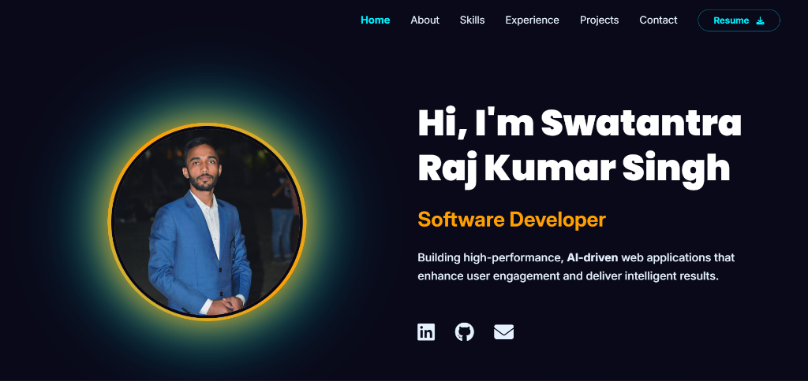

# 💼 Swatantra Portfolio

> A modern, responsive portfolio website showcasing my software development projects, technical skills, professional experience, and achievements.

<p align="center">
  
</p>


## 🌐 Live Demo

🔗 **https://swatantra-portfolio-eight.vercel.app/**

---

# 📌 Overview

This portfolio serves as my personal developer website, highlighting my journey as a **Software Developer & Project Manager**. It showcases real-world projects, technical expertise, work experience, certifications, and contact information in a clean and responsive interface.

The website is designed with performance, accessibility, and user experience in mind, making it easy for recruiters and collaborators to explore my work.

---

# ✨ Features

- Responsive design for all devices
- Modern UI with smooth animations
- Professional About section
- Skills & technology showcase
- Featured project portfolio
- Work experience timeline
- Certifications section
- Resume download
- Contact section
- Fast loading performance

---

# 🛠 Tech Stack

- React.js
- Vite
- JavaScript (ES6+)
- CSS3
- HTML5
- Framer Motion
- Git & GitHub
- Vercel

---

# 🚀 Installation

Clone the repository

```bash
git clone https://github.com/Swatantraraj19/Swatantra_Portfolio.git
```

Navigate to the project

```bash
cd Swatantra_Portfolio
```

Install dependencies

```bash
npm install
```

Run locally

```bash
npm run dev
```

Build for production

```bash
npm run build
```

---

# 📱 Responsive Design

The portfolio is fully optimized for:

- Desktop
- Laptop
- Tablet
- Mobile Devices

---

# 🎯 Purpose

This portfolio was built to:

- Showcase professional projects
- Demonstrate frontend development skills
- Highlight project management experience
- Present certifications and achievements
- Connect with recruiters and collaborators

---

# 📈 Future Improvements

- Blog Section
- Dark/Light Theme Toggle
- Project Filtering
- Internationalization (i18n)
- Performance Analytics
- Admin Dashboard for Content Management

---

# 👨‍💻 Author

**Swatantra Raj Kumar Singh**

**Software Developer | Project Manager | AI & Prompt Engineering Enthusiast**

📧 Email: *swatantrarajsingh1901@gmail.com*

💼 LinkedIn: *https://www.linkedin.com/in/swatantraraj19/*

🌐 Portfolio: **https://swatantra-portfolio-eight.vercel.app/**

🐙 GitHub: **https://github.com/Swatantraraj19**

---

## ⭐ Support

If you found this project useful, consider giving it a ⭐ on GitHub.
